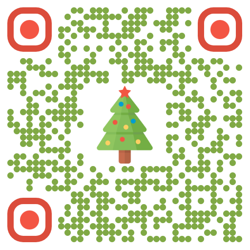

# Игра «Собери фразу» — Le Père Noël

Небольшая браузерная игра, где нужно собрать французские фразы про Пэра Ноэля из перемешанных кусочков. Есть ловушки, мгновенный русский перевод и возможность проверить себя или показать правильный ответ.

## Играть онлайн
https://roslovets.github.io/le-pere-noel/

## Как играть
- Нажимай на кусочки снизу — они добавляются в предложение.
- Клик по кусочку сверху убирает его обратно вниз.
- Можно перетаскивать слова в зоне сборки, чтобы менять их порядок.
- Жми «Проверить» для сверки или «Показать французский ответ», если хочешь подсказку.
- Смотри на прогресс-бар и счёт: решённые фразы учитываются в очках.

## Запуск локально
1. Скачай или клонируй репозиторий.
2. Открой `index.html` в браузере (достаточно двойного клика) — сервер не нужен.

## QR
Сканируй, чтобы открыть игру на телефоне:

